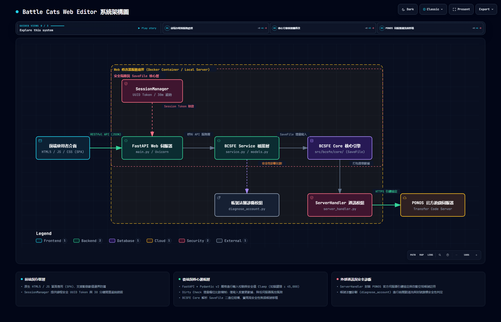

<div align="center">

# Battle Cats Web Editor

**基於 BCSFE 核心的貓咪大戰爭網頁版存檔編輯與安全移植工具**

[](./LICENSE)
[](https://www.python.org/)
[](https://fastapi.tiangolo.com/)

</div>

---

## 專案簡介

Battle Cats Web Editor 是專為《貓咪大戰爭》打造的高安全性網頁版存檔管理與編輯工具。專案採用 Python FastAPI 作為網頁後端，整合 BCSFE 核心引擎，提供直觀的單頁應用程式（SPA）介面。

本工具旨在提供便利的存檔編輯體驗，同時引入身分隔離移植、差異化欄位上傳（Dirty Check）以及安全限額保護機制，最大程度降低存檔異常與帳號風險。

## 核心特色

- **安全帳號移植與身分隔離**
  - **無損進度移植**：支援將來源存檔的貓咪解鎖、金寶進度、關卡紀錄與資源完整轉移至目標帳號。
  - **詢問碼身分隔離**：自動沿用目標空殼帳號的詢問碼（Inquiry Code）與伺服器憑證，防止因多存檔共用相同識別碼而引發連帶封鎖。
  - **時間戳重設與自動註冊**：上傳前清洗異常時間戳記並清除封號旗標；支援一鍵於伺服器自動註冊全新空殼帳號。

- **高安全性數值管理 (Dirty Check)**
  - **增量比對上傳**：僅上傳使用者實際修改過的欄位，減少對未變更記憶體區塊的動態覆寫。
  - **嚴格安全上限**：針對貓罐頭、經驗值、各類票券設定安全防護閾值（例如貓罐頭上限 45,000），避免觸發伺服器自動封禁機制。

- **全方位資源與進度編輯**
  - **基礎資源**：貓罐頭、經驗值 (XP)、NP、領導力、遊玩時間、黃金會員續訂狀態。
  - **轉蛋券與材料**：銀券、金券、白金券、傳說券、白金碎片、喵力達、貓眼石、貓薄荷、獸石、城堡素材與本能玉。
  - **關卡與解鎖**：主線故事（世界/未來/宇宙篇）、魔界篇進度、批次貓咪型態解鎖與等級調整。

## 運作原理

本工具後端透過 `ServerHandler` 封裝與 PONOS 官方伺服器通訊協定。使用者輸入引繼碼登入後，伺服器會將存檔下載至記憶體中解析為 `SaveFile` 物件。前端透過 RESTful API 進行數值修改與增量比對，確認後重新簽章並上傳至 PONOS 伺服器，回傳全新引繼碼與認證碼。



## 快速開始

### 存檔修改流程

1. 於遊戲內進入「選單」 -> 「轉移引繼資料」。
2. 點擊「上傳存檔到伺服器」，記下 **引繼碼 (Transfer Code)** 與 **認證碼 (Confirmation Code)**。
3. 於本修改器網頁輸入引繼代碼，選擇對應地區（TW, EN, JP, KR）與遊戲版本。
4. 完成資源或進度編輯後，點擊「儲存並上傳至伺服器」，取得全新引繼碼。
5. 於遊戲中選擇「恢復引繼資料」並輸入新代碼即可完成載入。

## 本地開發與部署

### 環境需求

- Python 3.9+
- Docker（可選，用於容器化部署）

### 本地執行

1. 複製專案庫：
   ```bash
   git clone https://github.com/thomas950321/BattleCats-Web-Editor.git
   cd BattleCats-Web-Editor
   ```

2. 安裝 Python 依賴套件：
   ```bash
   pip install -r requirements.txt
   ```

3. 啟動 FastAPI 服務：
   ```bash
   python bcsfe_web/main.py
   ```

4. 開啟瀏覽器存取 `http://localhost:8000`。

### Docker 部署

```bash
docker build -t battlecats-web-editor .
docker run -d -p 8000:7860 battlecats-web-editor
```

## 專案結構

```
BCSFE-Python/
├── bcsfe_web/           # FastAPI 網頁服務層 (API 路由、模型、業務服務)
│   ├── static/          # 前端單頁應用 (HTML, CSS, JS)
│   ├── main.py          # Web 入口點
│   ├── models.py        # Pydantic 資料模型
│   └── service.py       # 核心轉接服務
├── src/bcsfe/core/      # BCSFE 存檔解析與伺服器通訊引擎
├── diagnose_account.py  # 帳號安全性與法醫分析腳本
├── Dockerfile           # Docker 容器構建檔
└── pyproject.toml       # Python 專案配置
```

## 免責聲明

- 本工具僅供學術交流、技術研究與個人存檔備份使用。
- 請勿過度修改數值，過度修改可能導致遊戲帳號被官方封鎖，使用者需自行承擔相關風險。
- 請支持正版遊戲《貓咪大戰爭》。

## 致謝

- 核心邏輯引擎：[fieryhenry/BCSFE-Python](https://github.com/fieryhenry/BCSFE-Python)
- 網頁框架：[FastAPI](https://fastapi.tiangolo.com/)

## 授權條款

本專案採用 [GNU GPLv3](./LICENSE) 開源授權協定。
